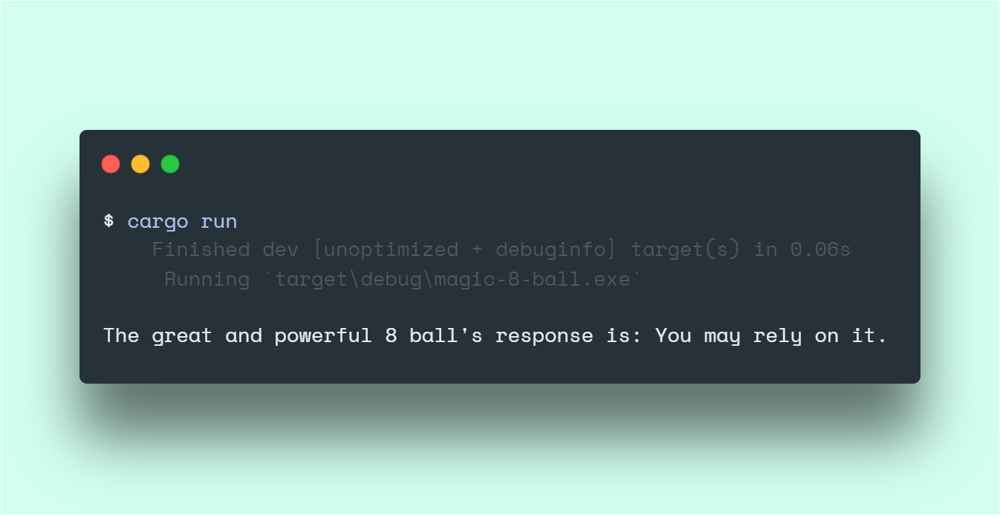

# 8ball-rust
> A Magic 8 Ball program written in Rust 🎱

*Hey GitHub! This is my **first project with Rust** 🦀! I am loving the langauge so far and can't wait to keep moving forward through this amazing journey!*

*If you have any feedback or advice for me, I'd love to hear it!*

## Usage

### Installing Rust

This was program was written in [Rust](https://rust-lang.org). If you don't have it installed on your system, [follow these instructions](https://www.rust-lang.org/learn/get-started).

After, verify that they are installed by running `rustc --version` and `cargo --version`.

### Running the Program

To "shake" the Magic 8 Ball, get a copy of this code (by forking and/or cloning this repo) and then running the following code in your terminal:

```sh
cargo run
```

Simple as that! You should get a random output. (As shown below)



### Build for production

If you want the more optomized and minified executable version of this program, run the following in your terminal:

```sh
cargo run --release
```

And then run the `.exe` file accordingly:

```sh
target/release/magic-8-ball.exe
```

## Dependency(s)
- `rand`: v0.3

---

## Like my work?

<a href="https://www.buymeacoffee.com/braydenw" target="_blank"></a>

*Made by [@BraydenTW](https://github.com/braydentw)*